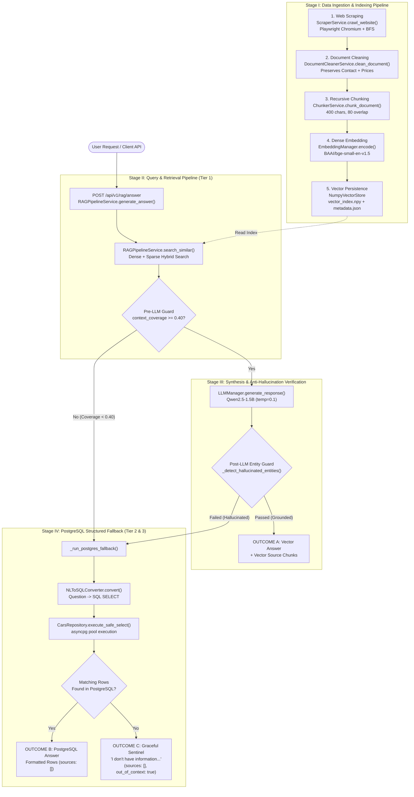
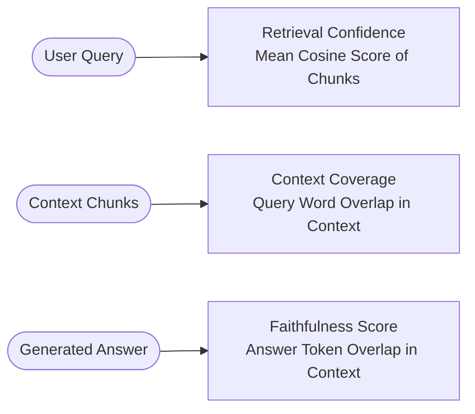

# 🏛️ CrawlRAG — Master Architecture & Complete Technical Index

Welcome to the **CrawlRAG Master Architecture Guide**. This document provides an end-to-end technical overview of CrawlRAG — a production-grade, 100% local, anti-hallucination Retrieval-Augmented Generation (RAG) system integrated with a PostgreSQL structured database fallback layer.

---

## 📌 Executive Summary — What is CrawlRAG?

CrawlRAG solves a fundamental challenge in enterprise AI: **How to deliver fast, accurate, and completely grounded answers from web content and structured databases without cloud API costs or LLM hallucinations.**

Traditional RAG applications often fail when asked out-of-context questions (e.g. asking about cricket scores on an auto dealership site), causing the LLM to invent false facts (hallucination). CrawlRAG eliminates this using a **3-Layer Anti-Hallucination Guard Network** and a **2-Tier Priority Search Pipeline**:

1. **Tier 1 (Vector Store RAG)**: Searches scraped unstructured web documents using dense embeddings + keyword phrase boosting. If vector context is strong and factual, synthesizes a grounded answer with local LLM (`Qwen2.5-1.5B`).
2. **Tier 2 (PostgreSQL Fallback)**: If vector search context is missing or weak, automatically converts the user's question into a safe SQL query using Natural Language to SQL (NL-to-SQL) and retrieves structured records from PostgreSQL.
3. **Tier 3 (Graceful Sentinel)**: If data is absent in both vector store and PostgreSQL, returns a clean, polite response (`"I don't have information about that in the available data."`) instead of guessing.

---

## 🗺️ Complete End-to-End System Architecture



---

## 🔁 The 3 Execution Outcomes Explained

Every incoming user request to `POST /api/v1/rag/answer` results in one of three clean execution outcomes:

| Outcome | Trigger Condition | Primary Data Source | API Response `answer` | `sources` Array | `is_out_of_context` |
| :--- | :--- | :--- | :--- | :--- | :--- |
| **Outcome A: Vector Store Hit** | Vector search finds relevant chunks ($\text{coverage} \ge 0.40$) and LLM answer passes entity grounding verification. | Scraped Web Chunks (`data/vector_store`) | Grounded LLM narrative answer synthesised from web chunks. | Array of `SearchResultItem` chunk objects. | `false` |
| **Outcome B: PostgreSQL Fallback Hit** | Vector context is missing/weak, but PostgreSQL SQL query returns matching rows. | PostgreSQL DB (`cars` table) | Formatted structured data card or bullet list from DB. | `[]` (Empty array) | `false` |
| **Outcome C: Graceful Sentinel** | Data is absent in both Vector Store and PostgreSQL DB. | System Anti-Hallucination Guard | `"I don't have information about that in the available data."` | `[]` (Empty array) | `true` |

---

## 📂 Master Module Directory & Code Mapping

Below is the complete file mapping showing exactly which Python class and function handles each stage of the system:

```text
d:\data-scraping-rag\data-scraping\backend\app\
├── core\
│   ├── config.py                 # Central settings & .env configuration reader
│   └── logging.py                # Structured system logging configuration
├── modules\
│   ├── scraping\                 # STAGE I: Web Scraping Module
│   │   ├── fetcher.py            # Playwright Chromium headless fetcher & JS renderer
│   │   ├── parser.py             # BeautifulSoup HTML DOM parser & metadata extractor
│   │   ├── service.py            # BFS recursive crawler & Document Store manager
│   │   └── router.py             # FastAPI routes for web scraping (/scraping/*)
│   ├── rag\                      # STAGE II & III: Vector RAG & Synthesis Engine
│   │   ├── cleaner.py            # Text cleaner (strips nav/footers, preserves contacts)
│   │   ├── chunker.py            # Recursive character text chunker (400 size / 80 overlap)
│   │   ├── embeddings.py         # Embedding manager (BAAI/bge-small-en-v1.5)
│   │   ├── vector_store.py       # In-memory NumPy matrix vector store
│   │   ├── llm.py                # Local LLM generation engine (Qwen2.5-1.5B-Instruct)
│   │   ├── service.py            # Unified RAG orchestrator & Anti-Hallucination Guards
│   │   └── router.py             # FastAPI route for RAG (/rag/answer, /rag/search)
│   └── database\                 # STAGE IV: PostgreSQL Fallback Layer
│       ├── connection.py         # asyncpg connection pool manager
│       ├── nl_to_sql.py          # Natural Language to SQL converter (Qwen prompt engine)
│       ├── repository.py         # Cars table repository, SQL sanitizer & keyword search
│       └── router.py             # FastAPI routes for database management (/db/*)
```

---

## 📊 RAG Triad — Production Quality Metrics

CrawlRAG calculates three mathematical evaluation metrics for every single response to monitor retrieval quality and answer faithfulness in real time:

$$\text{RAG Triad} = \Big( \text{Retrieval Confidence}, \, \text{Context Coverage}, \, \text{Faithfulness Score} \Big)$$



| Metric Name | Formula / Calculation Method | Range | Target Threshold | Interpretation |
| :--- | :--- | :--- | :--- | :--- |
| **`retrieval_confidence`** | $\frac{1}{K} \sum_{i=1}^K \text{score}(c_i)$ | `0.0` to `1.0` | $\ge 0.35$ | Average semantic similarity score of retrieved chunks. Higher means retrieved text closely matches query intent. |
| **`context_coverage`** | $\frac{|\text{QueryWords} \cap \text{ContextWords}|}{|\text{QueryWords}|}$ | `0.0` to `1.0` | $\ge 0.40$ | Ratio of non-stopword query keywords present in context. Below `0.40` triggers PostgreSQL fallback. |
| **`faithfulness_score`** | $\frac{|\text{AnswerWords} \cap \text{ContextWords}|}{|\text{AnswerWords}|}$ | `0.0` to `1.0` | $\ge 0.80$ | Proportion of generated answer tokens backed by context. Low score indicates LLM hallucination. |

---

## 📚 Deep-Dive Documentation Index

To explore the inner workings, code implementations, and mathematical details of any specific component, click on the detailed module guides below:

1. 🟢 [**01 Web Scraping Module Guide**](file:///d:/data-scraping-rag/data-scraping/docs/01_web_scraping_module.md) — BFS crawling, Playwright rendering, HTML parsing.
2. 🧹 [**02 Cleaning & Chunking Module Guide**](file:///d:/data-scraping-rag/data-scraping/docs/02_cleaning_and_chunking.md) — Boilerplate stripping, entity preservation, recursive character chunking.
3. 📐 [**03 Embeddings & Vector Store Guide**](file:///d:/data-scraping-rag/data-scraping/docs/03_embeddings_and_vector_store.md) — BGE-small-en-v1.5 model, L2 normalization, NumPy vector store.
4. 🔍 [**04 Hybrid Search & Retrieval Guide**](file:///d:/data-scraping-rag/data-scraping/docs/04_hybrid_search_and_retrieval.md) — Dense + sparse hybrid scoring, phrase boost weights, query reframing.
5. 🤖 [**05 Unified RAG Engine & Anti-Hallucination Guide**](file:///d:/data-scraping-rag/data-scraping/docs/05_unified_rag_and_anti_hallucination.md) — Single endpoint flow, Qwen 1.5B synthesis, 3-layer anti-hallucination network.
6. 🐘 [**06 PostgreSQL Database Fallback Guide**](file:///d:/data-scraping-rag/data-scraping/docs/06_postgresql_database_fallback.md) — NL-to-SQL conversion, `asyncpg` connection pooling, repository query layer.
