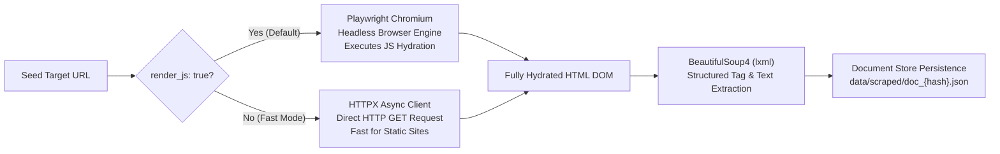
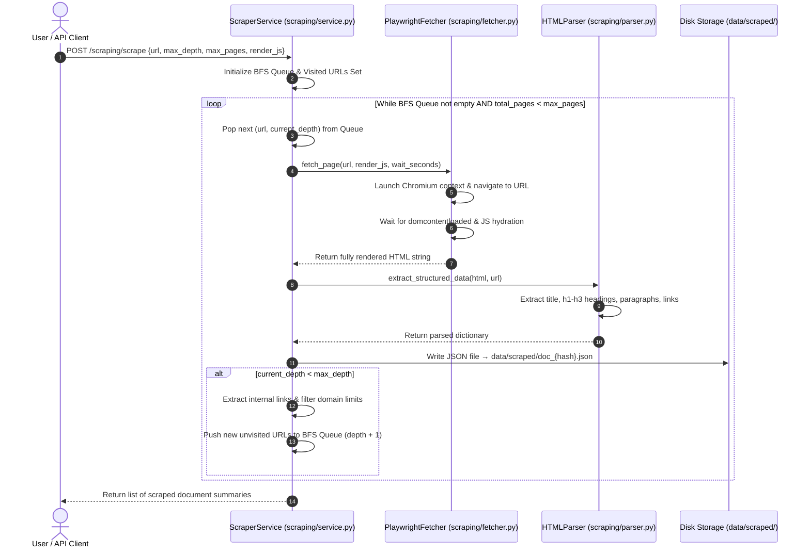

# 🕸️ Web Scraping Module — Deep-Dive Technical Guide

The **Web Scraping Module** is the data acquisition engine of CrawlRAG. It is designed to automatically discover, crawl, render, parse, and save web content — including modern JavaScript-rendered Single Page Applications (SPAs) like React, Vue, and Angular — into clean, structured JSON documents.

---

## 📌 1. High-Level Purpose — Why Playwright + BeautifulSoup?

Standard HTTP fetchers (like `requests` or `urllib`) only download static raw HTML. They fail completely on modern websites that load content dynamically via JavaScript APIs. 

To solve this, CrawlRAG uses a hybrid two-tier fetching strategy:



### Key Benefits:
- **Full SPA Support**: Renders client-side JavaScript, populating dynamic UI elements, tables, and product listings.
- **Resilient Fallback**: Allows switching to HTTPX for 10x faster static page scraping when JS execution is not required.
- **No Heavy Scrapy Dependencies**: Lightweight, fully asynchronous implementation native to FastAPI.

---

## 🔄 2. Step-by-Step Crawler Lifecycle

When a client calls `POST /api/v1/scraping/scrape`, the crawler executes the following step-by-step pipeline:



---

## 🛠️ 3. Detailed Component & Function Breakdown

### A. Headless Browser Renderer (`PlaywrightFetcher`)
- **File Path**: [`app/modules/scraping/fetcher.py`](file:///d:/data-scraping-rag/data-scraping/backend/app/modules/scraping/fetcher.py#L30-L130)
- **Primary Method**: `async def fetch_page(url: str, render_js: bool = True, wait_seconds: float = 2.0) -> str`
- **Mechanism**:
  1. Spawns an isolated Chromium browser context using `playwright.async_api`.
  2. Sets a realistic User-Agent header (`Chrome/125.0.0.0 CrawlRAG/1.0`) to avoid basic bot blocks.
  3. Navigates to the page with a configurable timeout (`REQUEST_TIMEOUT_SECONDS = 30.0`).
  4. Executes `asyncio.sleep(wait_seconds)` to allow AJAX requests and React state updates to settle before capturing `page.content()`.

### B. HTML Structure Parser (`HTMLParser`)
- **File Path**: [`app/modules/scraping/parser.py`](file:///d:/data-scraping-rag/data-scraping/backend/app/modules/scraping/parser.py#L25-L120)
- **Primary Method**: `def extract_structured_data(html_content: str, source_url: str) -> Dict[str, Any]`
- **Parsing Strategy**:
  - Uses `BeautifulSoup(html_content, "lxml")`.
  - Strips inline `<script>`, `<style>`, `<noscript>`, and `<iframe>` elements to clean the DOM tree.
  - Extracts `<title>` text (falls back to `h1` or domain name if missing).
  - Groups headings hierarchically: `h1`, `h2`, `h3`.
  - Extracts all `<p>` text blocks, stripping empty whitespace.
  - Finds all `<a href="...">` anchor tags, converts relative paths to absolute URLs using `urllib.parse.urljoin`, and filters out non-HTTP schemes (`mailto:`, `javascript:`, `tel:`).

### C. BFS Crawler & Orchestrator (`ScraperService`)
- **File Path**: [`app/modules/scraping/service.py`](file:///d:/data-scraping-rag/data-scraping/backend/app/modules/scraping/service.py#L40-L240)
- **Primary Method**: `async def crawl_website(request: ScrapeRequest) -> List[Dict[str, Any]]`
- **Duplication Prevention**: Maintains a hash-set of visited normalized URLs (`visited_urls`).
- **File Naming**: Generates a deterministic document ID using SHA-256 hash of the normalized URL:
  $$\text{doc\_id} = \text{"doc\_"} + \text{SHA256}(\text{url})[:12]$$

---

## 📊 4. Input vs Output Data Example

### Input Scraping Request (`POST /api/v1/scraping/scrape`):
```json
{
  "url": "https://webscraper.io/test-sites/pagination/BMW",
  "max_depth": 1,
  "max_pages": 5,
  "render_js": true,
  "wait_seconds": 1.5
}
```

### Output Saved JSON File (`data/scraped/doc_bd7ffff93fcd.json`):
```json
{
  "doc_id": "doc_bd7ffff93fcd",
  "url": "https://webscraper.io/test-sites/pagination/BMW",
  "title": "Test site with pagination links | Web Scraper Test Sites",
  "scraped_at": "2026-08-17T20:00:00.000000",
  "content": {
    "headings": {
      "h1": ["Test site with pagination links"],
      "h2": ["BMW E28 535i 1970", "BMW E30 M3 1975"],
      "h3": []
    },
    "paragraphs": [
      "Homologation M3, Concours condition. Year: 1975, Mileage: 186,306 km, Price: USD 347,873."
    ],
    "raw_text": "Test site with pagination links ... USD 347,873"
  },
  "metadata": {
    "word_count": 420,
    "internal_links_count": 16,
    "depth": 0
  }
}
```

---

## ⚠️ 5. Edge Cases & Error Handling

> [!TIP]
> **Page Timeout**: If a web page takes longer than 30 seconds to load, `PlaywrightFetcher` catches `TimeoutError`, logs a warning, and gracefully falls back to basic HTTPX fetching without throwing a server crash.

> [!WARNING]
> **Infinite Scroll / Pagination Loops**: The crawler prevents infinite link loops by enforcing `max_pages` cap, `max_depth` limits, and strict canonical URL normalization (stripping anchor tags `#section` and tracking parameters `?utm_source=...`).
