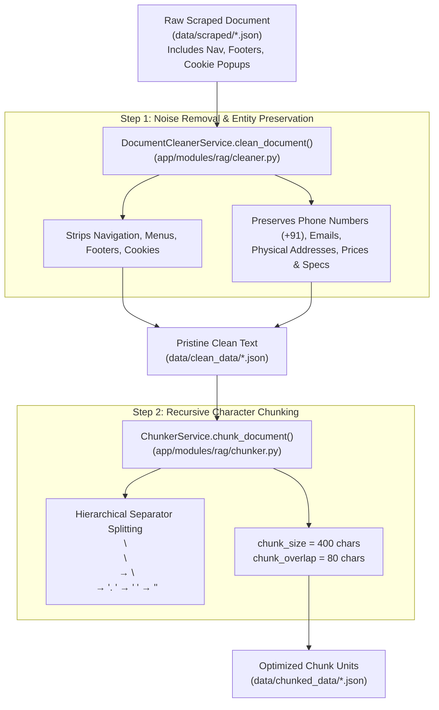

# 🧹 Document Cleaning & Chunking Module — Deep-Dive Technical Guide

The **Document Cleaning & Chunking Module** is the data preparation bridge between raw scraped web pages and vector search. It transforms noisy web content into pristine, structured, and semantically cohesive text blocks ready for embedding.

---

## 📌 1. High-Level Overview — Why Clean and Chunk?

Raw web scrapings are full of noise: cookie popups, header menus, footer copyright statements, and social media widgets. If fed directly to an AI model, this clutter degrades search precision and leads to hallucinations.



---

## 🧹 2. Deep Dive: Document Cleaning (`DocumentCleanerService`)

- **File Path**: [`app/modules/rag/cleaner.py`](file:///d:/data-scraping-rag/data-scraping/backend/app/modules/rag/cleaner.py#L30-L160)
- **Primary Function**: `DocumentCleanerService.clean_document(raw_doc: Dict[str, Any]) -> Dict[str, Any]`

### Boilerplate Removal Rules:
The cleaner applies regex and length heuristic filters (`_is_boilerplate`) to identify and remove web clutter:
1. **Navigation Menus**: Filters out text lines matching menu words (`"Home"`, `"About Us"`, `"Cart"`, `"Checkout"`, `"Privacy Policy"`).
2. **Cookie & Popups**: Strips standard cookie consent patterns (`"We use cookies to enhance..."`, `"Accept All"`).
3. **Orphan Paragraph Dropping**: Drops any text fragment shorter than `min_paragraph_length` (default: 20 characters), eliminating UI button labels and isolated text fragments.

### 🛡️ Entity Preservation Rules (Crucial for Factual Grounding):
While stripping boilerplate, the cleaner explicitly safeguards business-critical entity patterns:
- **Phone Numbers**: Preserves Indian format (`+91 9876543210`, `011-23456789`), international formats, and toll-free numbers.
- **Email Addresses**: Preserves standard email patterns (`support@company.com`).
- **Financial Figures**: Preserves currency symbols and numbers (`USD 347,873`, `£45.17`, `₹1,50,000`).
- **Technical & Vehicle Specs**: Preserves model names (`E30 M3`, `308 GTB`), manufacturing years (`1975`), and mileage (`186,306 km`).

Saved to: `data/clean_data/{doc_id}.json`.

---

## ✂️ 3. Deep Dive: Recursive Character Chunking (`ChunkerService`)

- **File Path**: [`app/modules/rag/chunker.py`](file:///d:/data-scraping-rag/data-scraping/backend/app/modules/rag/chunker.py#L35-L170)
- **Primary Function**: `ChunkerService.chunk_document(clean_doc: Dict[str, Any]) -> List[Dict[str, Any]]`

### Why 400 Chunk Size and 80 Overlap?

> [!IMPORTANT]
> **Chunk Size Tuning**:
> - **Too Large (1000+ chars)**: Chunks contain multiple unrelated topics, diluting embedding vector focus and reducing retrieval precision.
> - **Too Small (<150 chars)**: Chunks lose context, splitting sentences in half and fragmenting meaning.
> - **Optimal Choice (400 chars)**: Fits approximately 60–80 English words (1–2 cohesive paragraphs), providing exact semantic focus for `bge-small-en-v1.5`.

> [!TIP]
> **Chunk Overlap Tuning (80 chars / 20%)**:
> - Overlap ensures that key phrases spanning chunk boundaries (e.g. `"Price: USD"` at the end of Chunk 1 and `"347,873"` at the start of Chunk 2) are captured together in adjacent chunks, preventing context loss.

### Separator Priority Cascade:
The chunker splits text hierarchically, trying natural boundaries first before resorting to character splits:

```python
SEPARATORS = [
    "\n\n",  # Priority 1: Double newline (Paragraph boundary)
    "\n",    # Priority 2: Single newline (Line break)
    ". ",    # Priority 3: Sentence boundary
    " ",     # Priority 4: Word boundary
    ""       # Priority 5: Character fallback
]
```

### Orphan Chunk Merging:
If a trailing chunk is created that is smaller than `min_chunk_size` (60 characters), the chunker automatically merges it into the preceding chunk rather than leaving an orphan 1-line fragment.

---

## 📊 4. Data Transformation Example

### Clean Text Input (`data/clean_data/doc_bd7ffff93fcd.json`):
```text
### BMW E30 M3 1975
Homologation M3, Concours condition. Year: 1975, Country of origin: Italy, Mileage: 186,306 km, Price: USD 347,873.

### BMW E28 535i 1968
Driver condition E28 535i, recent service history. Year: 1968, Country of origin: United Kingdom, Mileage: 44,686 km, Price: USD 349,488.
```

### Output Generated Chunks (`data/chunked_data/doc_bd7ffff93fcd_chunks.json`):
```json
[
  {
    "chunk_id": "doc_bd7ffff93fcd_chunk_001",
    "doc_id": "doc_bd7ffff93fcd",
    "chunk_index": 1,
    "text": "### BMW E30 M3 1975\nHomologation M3, Concours condition. Year: 1975, Country of origin: Italy, Mileage: 186,306 km, Price: USD 347,873.",
    "title": "Test site with pagination links | Web Scraper Test Sites",
    "url": "https://webscraper.io/test-sites/pagination/BMW",
    "word_count": 24,
    "char_count": 134
  },
  {
    "chunk_id": "doc_bd7ffff93fcd_chunk_002",
    "doc_id": "doc_bd7ffff93fcd",
    "chunk_index": 2,
    "text": "### BMW E28 535i 1968\nDriver condition E28 535i, recent service history. Year: 1968, Country of origin: United Kingdom, Mileage: 44,686 km, Price: USD 349,488.",
    "title": "Test site with pagination links | Web Scraper Test Sites",
    "url": "https://webscraper.io/test-sites/pagination/BMW",
    "word_count": 26,
    "char_count": 154
  }
]
```

---

## 💡 Code Symbol Map

- `DocumentCleanerService.clean_document()`: Entry point for raw document cleaning.
- `DocumentCleanerService._clean_paragraph()`: Whitespace and noise removal per paragraph.
- `DocumentCleanerService._is_boilerplate()`: Regex matcher for web boilerplate patterns.
- `ChunkerService.chunk_document()`: Entry point for document text chunking.
- `ChunkerService._split_text()`: Recursive character splitter logic.
- `ChunkerService._merge_splits()`: Combines text splits up to 400 characters with 80-character overlap.
