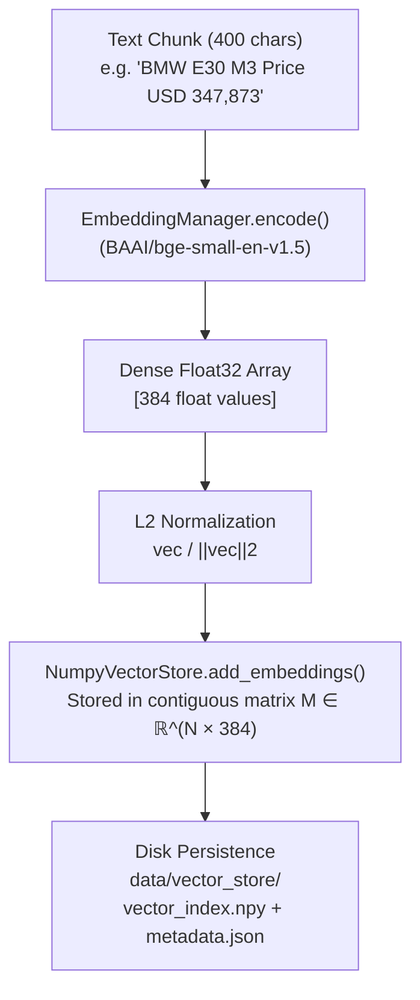

# 📐 Embeddings & Vector Store Module — Deep-Dive Technical Guide

The **Embeddings & Vector Store Module** converts human text chunks into high-dimensional numerical vectors (embeddings) and stores them in a high-performance in-memory matrix for instant mathematical search.

---

## 📌 1. High-Level Concept — What is a Text Embedding?

A **Text Embedding** is a mathematical representation of a sentence or paragraph as a dense vector of numbers in a multi-dimensional semantic space. 

Words or sentences with similar meanings are positioned close together in this mathematical space, even if they use completely different vocabulary (e.g. `"automobile price"` and `"car cost"` produce almost identical vectors).



---

## 🤖 2. Deep Dive: Model Selection — `BAAI/bge-small-en-v1.5`

### Model Specifications:
- **Model Name**: `BAAI/bge-small-en-v1.5` (BAAI = Beijing Academy of Artificial Intelligence)
- **Vector Dimension**: `384` floating-point numbers per vector
- **Model Size on Disk**: ~130 MB
- **Context Window**: 512 tokens (~400 words)
- **Framework**: `sentence-transformers` / PyTorch (CPU & GPU compatible)

### Why BGE-Small over other models?

| Feature / Metric | `BAAI/bge-small-en-v1.5` (CrawlRAG Choice) | `all-MiniLM-L6-v2` (Legacy Default) | `text-embedding-3-small` (OpenAI) |
| :--- | :--- | :--- | :--- |
| **MTEB Benchmark Score** | **62.11** (1st in class) | 56.26 | 62.30 |
| **Model Size** | **130 MB** (Fast load) | 90 MB | Cloud API Only |
| **Execution Cost** | **100% Free & Local (CPU)** | 100% Free & Local (CPU) | \$0.02 / 1M tokens |
| **Privacy & Offline** | **100% Offline / Local** | 100% Offline / Local | Cloud API (Privacy Risk) |
| **Dimension** | **384** (Low memory footprint) | 384 | 1536 (4x memory) |

---

## 📐 3. Mathematical Foundations: L2 Normalization & Dot Product

- **File Path**: [`app/modules/rag/embeddings.py`](file:///d:/data-scraping-rag/data-scraping/backend/app/modules/rag/embeddings.py#L30-L120)
- **Primary Method**: `EmbeddingManager.encode(texts: List[str], batch_size: int = 32) -> np.ndarray`

### L2 Normalization Formula:
When embeddings are generated, `EmbeddingManager` immediately normalizes each vector to unit length ($\|\vec{v}\|_2 = 1$):

$$\vec{v}_{\text{normalized}} = \frac{\vec{v}}{\sqrt{\sum_{i=1}^{384} v_i^2}}$$

### Cosine Similarity Simplification:
The Cosine Similarity between a query vector $\vec{q}$ and a candidate chunk vector $\vec{d}$ is defined as:

$$\text{CosineSimilarity}(\vec{q}, \vec{d}) = \frac{\vec{q} \cdot \vec{d}}{\|\vec{q}\|_2 \|\vec{d}\|_2}$$

Because both $\vec{q}$ and $\vec{d}$ are normalized to unit length ($\|\vec{q}\|_2 = 1$ and $\|\vec{d}\|_2 = 1$), the denominator equals $1$. The formula simplifies to a **pure dot product**:

$$\text{CosineSimilarity}(\vec{q}, \vec{d}) = \vec{q} \cdot \vec{d} = \sum_{k=1}^{384} q_k \cdot d_k$$

This simplification allows matrix-vector multiplication (`np.dot`), executing search queries over thousands of vectors in **< 1.5 milliseconds on CPU**!

---

## 🗄️ 4. NumPy Vector Store Architecture (`NumpyVectorStore`)

- **File Path**: [`app/modules/rag/vector_store.py`](file:///d:/data-scraping-rag/data-scraping/backend/app/modules/rag/vector_store.py#L30-L190)
- **Class**: `NumpyVectorStore`

### In-Memory Storage Mechanics:
- **Vector Matrix**: Embeddings are stored in a contiguous 2D NumPy array $M \in \mathbb{R}^{N \times 384}$, where $N$ is the total number of indexed chunks.
- **Metadata Alignment**: Maintains a parallel Python list `chunk_metadata` of length $N$, where index $i$ in `chunk_metadata` corresponds exactly to row $i$ in the vector matrix.

### Computation Method:
```python
def compute_cosine_similarities(self, query_embedding: np.ndarray) -> np.ndarray:
    """Compute cosine similarity of query against all stored vectors in one matrix multiplication."""
    if self.count() == 0:
        return np.array([])
    # Matrix-vector dot product: (N, 384) x (384, 1) -> (N,)
    return np.dot(self.vectors, query_embedding.T).flatten()
```

### Disk Persistence Format:
Vector indices are stored in `data/vector_store/`:
1. `vector_index.npy`: Binary NumPy matrix file containing float32 vectors.
2. `metadata.json`: JSON array storing metadata dictionary objects for each chunk (`chunk_id`, `doc_id`, `url`, `title`, `text`, `chunk_index`).

---

## 💡 Code Symbol Map

- `EmbeddingManager.encode()`: Encodes text strings into 384-dim normalized NumPy array.
- `EmbeddingManager.is_cached_locally()`: Checks if model weights exist in `models/embeddings`.
- `NumpyVectorStore.add_embeddings()`: Appends new vectors to matrix $M$.
- `NumpyVectorStore.compute_cosine_similarities()`: BLAS dot-product similarity computation.
- `NumpyVectorStore.save()` / `NumpyVectorStore.load()`: Disk persistence routines.
