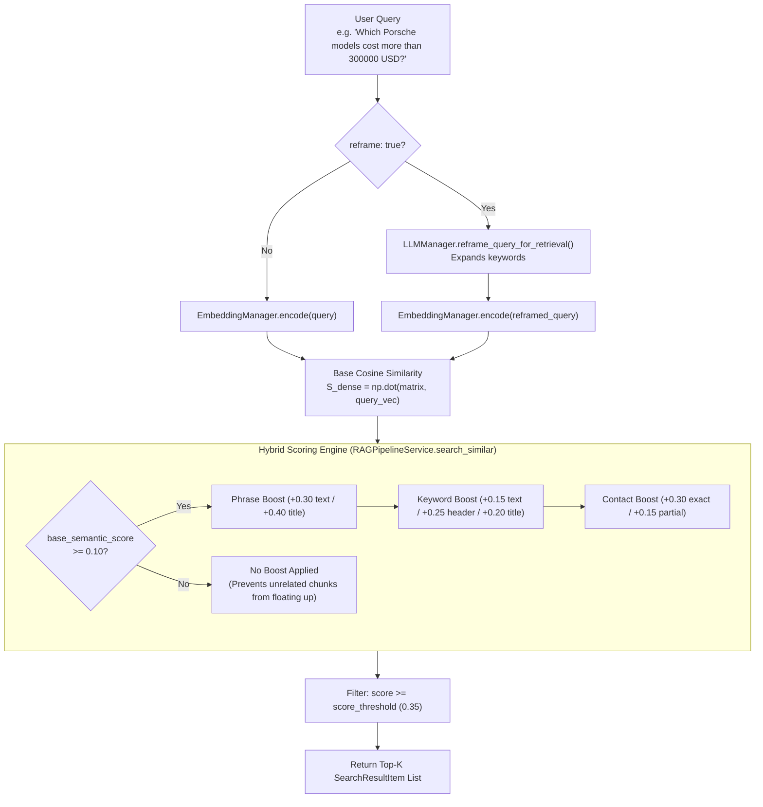

# 🔍 Hybrid Search & Retrieval Algorithm — Deep-Dive Technical Guide

The **Retrieval Subsystem** in CrawlRAG implements a multi-stage **Dense + Sparse Hybrid Search** algorithm. It combines dense neural semantic search with exact phrase and keyword boosting to achieve maximum precision for both conceptual questions and specific entity queries (prices, phone numbers, model numbers).

---

## 📌 1. High-Level Concept — Why Hybrid Search?

Traditional vector search (Dense Retrieval) excels at understanding intent and broad concepts (e.g., matching `"automobile"` with `"car"`). However, it struggles with **exact numbers, phone numbers, and unique product codes** (e.g., searching for a specific price `"349488"` or model `"E28 535i"`).

To solve this, CrawlRAG combines:
1. **Dense Vector Search** (`bge-small-en-v1.5` cosine similarity) for deep semantic understanding.
2. **Sparse Keyword & Phrase Boosting** for exact match precision on titles, section headers, and numbers.

---

## 📊 2. Mathematical Hybrid Scoring Formula

- **File Path**: [`app/modules/rag/service.py`](file:///d:/data-scraping-rag/data-scraping/backend/app/modules/rag/service.py#L440-L560)
- **Primary Method**: `RAGPipelineService.search_similar(query: str, top_k: int, score_threshold: float, reframe: bool)`

For each candidate text chunk $i$, the final hybrid score $S_{\text{hybrid}}(i)$ is calculated as:

$$S_{\text{hybrid}}(i) = S_{\text{dense}}(i) + \mathbb{I}_{\left(S_{\text{dense}}(i) \ge 0.10\right)} \times \left( \Delta_{\text{phrase}} + \Delta_{\text{keyword}} + \Delta_{\text{contact}} \right)$$

### Key Formula Components:
- **$S_{\text{dense}}(i)$**: Base cosine similarity score ($\text{np.dot}$) between query embedding and chunk vector.
- **$\mathbb{I}_{\left(S_{\text{dense}}(i) \ge 0.10\right)}$**: **Hallucination Guard Indicator**. Keyword boosts are applied **ONLY IF** the chunk has at least a weak base semantic similarity ($\ge 0.10$). 
  
> [!IMPORTANT]
> **Why the `0.10` Semantic Guard?**
> Without this indicator, a completely unrelated chunk (like a privacy policy page containing the single word `"car"`) could get an artificial keyword boost and float to the top of the search results. Requiring $S_{\text{dense}} \ge 0.10$ ensures that keyword boosting only promotes chunks that are topically relevant.

---

## ⚙️ 3. Boost Coefficient Reference Table

| Boost Category | Code Constant Name | Weight Added | Trigger Condition |
| :--- | :--- | :--- | :--- |
| **Exact Phrase in Text** | `_PHRASE_TEXT_BOOST` | `+0.30` | Full multi-word query phrase appears in chunk text |
| **Exact Phrase in Title** | `_PHRASE_TITLE_BOOST` | `+0.40` | Full multi-word query phrase appears in document title |
| **Keyword in Text** | `_KEYWORD_TEXT_BOOST` | `+0.15` | Individual non-stopword query token appears in chunk text |
| **Keyword in Section Header**| `_KEYWORD_SECTION_BOOST` | `+0.25` | Keyword appears after Markdown header (`#`, `###`) |
| **Keyword in Title** | `_KEYWORD_TITLE_BOOST` | `+0.20` | Keyword appears in document title |
| **Contact Exact Intent** | `_CONTACT_EXACT_BOOST` | `+0.30` | Query has contact intent & chunk URL has 'contact' with phone/address |
| **Contact Partial Intent** | `_CONTACT_PARTIAL_BOOST` | `+0.15` | Query has contact intent & chunk contains '+91' or 'our address' |

---

## 🔄 4. LLM Query Reframing (`reframe=True`)

- **File Path**: [`app/modules/rag/llm.py`](file:///d:/data-scraping-rag/data-scraping/backend/app/modules/rag/llm.py#L120-L175)
- **Method**: `LLMManager.reframe_query_for_retrieval(query: str) -> str`

When a query is vague or very short (e.g. `"best book"`), standard vector search might miss relevant results.

### Reframing Process:
1. `Qwen2.5-1.5B-Instruct` is prompted to expand the query into search keywords:
   - Input: `"best book"`
   - Reframed Output: `"top rated highly reviewed popular books catalogue listing price category"`
2. The search engine encodes both original and reframed queries, taking the **element-wise maximum** similarity score across both vectors:
   $$\vec{S}_{\text{dense}} = \max\left( \vec{S}_{\text{original}}, \, \vec{S}_{\text{reframed}} \right)$$

This ensures high recall without sacrificing accuracy for precise queries.

---

## 💡 Code Symbol Map

- `RAGPipelineService.search_similar()`: Hybrid search orchestrator.
- `LLMManager.reframe_query_for_retrieval()`: LLM query expansion.
- `_RETRIEVAL_STOP_WORDS`: Filtering set for English stopwords.
- `_CONTACT_INTENT_KEYWORDS`: Keyword set (`phone`, `contact`, `address`, `email`, `location`).
