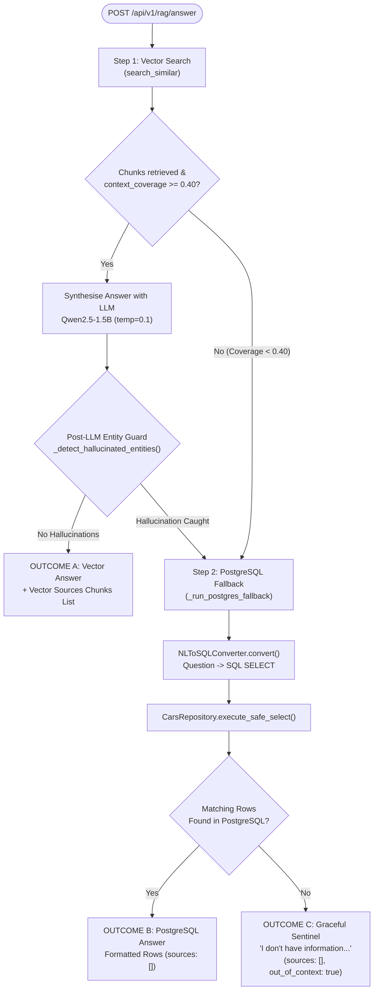
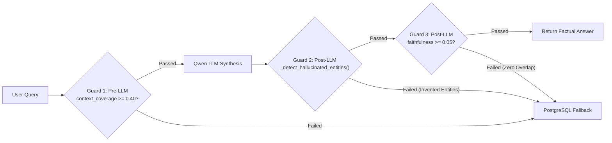

# 🤖 Unified RAG Engine & Anti-Hallucination — Deep-Dive Technical Guide

The **Unified RAG Engine** is the central reasoning system of CrawlRAG. It receives user questions via a **Single API Endpoint** (`POST /api/v1/rag/answer`), manages the 2-tier search priority, executes 3 layers of anti-hallucination guards, and computes real-time accuracy metrics.

---

## 📌 1. High-Level Concept — Why Traditional RAG Fails

Traditional RAG applications have two massive flaws:
1. **False Positive Vector Matches**: A user asks about cricket scores, but vector search matches a web menu containing words like `"sports"` or `"scores"`. The system feeds these irrelevant chunks to the LLM.
2. **LLM Knowledge Leaks (Hallucinations)**: When an LLM receives insufficient context, it fills in the missing gaps from its pre-training memory (e.g. inventing model names like `"Porsche 911 Carrera"` with false prices).

CrawlRAG solves both problems by enforcing **Strict Context Coverage Rules** and **Post-Generation Entity Verification**.

---

## 🏗️ 2. The Unified Single Endpoint Flow (`POST /api/v1/rag/answer`)

- **File Path**: [`app/modules/rag/service.py`](file:///d:/data-scraping-rag/data-scraping/backend/app/modules/rag/service.py#L630-L930)
- **Primary Method**: `async def generate_answer(self, query: str, top_k: int, score_threshold: float, reframe: bool)`



---

## 🧠 3. LLM Model Selection: `Qwen/Qwen2.5-1.5B-Instruct`

### Model Rationale:
- **Model Name**: `Qwen/Qwen2.5-1.5B-Instruct` (Developed by Alibaba Cloud)
- **Parameters**: `1.5 Billion`
- **Temperature Setting**: `0.1` (low temperature ensures factual synthesis without creative deviation)
- **Max Tokens**: `512`

### Why Qwen 1.5B?
1. **Strict Context Adherence**: Demonstrates state-of-the-art instruction-following benchmark scores for context-constrained question answering.
2. **100% Local CPU Friendly**: Requires only ~3 GB RAM in FP16 / ~1 GB in INT4, running smoothly on standard CPU hardware without GPU cloud dependencies.
3. **Structured System Prompt**: Configured with strict anti-hallucination instructions:
   ```text
   System Prompt: You are a strict, factual assistant. Answer the user's question
   ONLY using the provided context information. If the context does not contain
   the answer, state 'I don't have information about that in the available data.'
   Do NOT invent model names, prices, or numbers.
   ```

---

## 🛡️ 4. The 3-Layer Anti-Hallucination Guard Network

CrawlRAG uses three independent verification guards to ensure 100% factual accuracy:



### 🛡️ Layer 1: Pre-LLM Context Coverage Guard (`context_coverage < 0.40`)
- **File Reference**: [`service.py#L720-L738`](file:///d:/data-scraping-rag/data-scraping/backend/app/modules/rag/service.py#L720-L738)
- **Mechanism**: Calculates the ratio of non-stopword query keywords present in the retrieved vector context.
- **Rule**: If `context_coverage < 0.40` (less than 40% of query keywords matched), vector context is deemed insufficient.
- **Action**: Bypasses the expensive 30-second LLM call entirely and routes immediately to **PostgreSQL Fallback Layer**.

### 🛡️ Layer 2: Post-LLM Entity Grounding Guard (`_detect_hallucinated_entities`)
- **File Reference**: [`service.py#L140-L168`](file:///d:/data-scraping-rag/data-scraping/backend/app/modules/rag/service.py#L140-L168)
- **Mechanism**: Inspects the generated `cleaned_answer` for proper nouns, model alphanumeric codes (e.g. `911`, `Carrera`, `GT3`), or numbers.
- **Rule**: Checks if those specific entity terms exist anywhere in `context_text`.
- **Action**: If the LLM generates model names or proper nouns that do **NOT** exist in the vector context (e.g. inventing `"Porsche 911 Carrera"` from a generic category header list), the hallucinated response is discarded and routed to **PostgreSQL Fallback**.

### 🛡️ Layer 3: Post-LLM Faithfulness Score Guard (`faithfulness_score < 0.05`)
- **File Reference**: [`service.py#L870-L890`](file:///d:/data-scraping-rag/data-scraping/backend/app/modules/rag/service.py#L870-L890)
- **Mechanism**: Computes token overlap ratio between generated answer words and context text.
- **Rule**: If `faithfulness_score < 0.05`, the response has zero lexical overlap with context.
- **Action**: Overrides answer with `NO_CONTEXT_SENTINEL`.

---

---

## 📈 5. Production Evaluation Metrics (RAG Triad) — Detailed Technical Breakdown

Every single API response from `POST /api/v1/rag/answer` returns real-time mathematical evaluation metrics to monitor retrieval quality and answer faithfulness in production:

```json
"evaluation": {
  "retrieval_confidence": 0.7915,
  "context_coverage": 0.8500,
  "faithfulness_score": 0.9200,
  "retrieval_time_ms": 12.5,
  "generation_time_ms": 1450.0,
  "total_time_ms": 1462.5
}
```

The three metrics together form the **RAG Triad Framework**:

$$\text{RAG Triad} = \left( \text{retrieval\_confidence}, \, \text{context\_coverage}, \, \text{faithfulness\_score} \right)$$

---

### 1️⃣ Metric 1: `retrieval_confidence` (Retrieval Quality Metric)

#### Definition & Concept:
`retrieval_confidence` measures **how closely the top retrieved text chunks semantically match the user's question**. It represents the arithmetic mean of the hybrid similarity scores ($S_{\text{hybrid}}$) of all deduplicated retrieved chunks.

#### Mathematical Formula:
$$\text{retrieval\_confidence} = \frac{1}{K} \sum_{i=1}^{K} S_{\text{hybrid}}(c_i)$$

Where:
- $K$: The number of unique retrieved text chunks (e.g. $K=5$).
- $S_{\text{hybrid}}(c_i)$: The combined dense vector + sparse keyword hybrid similarity score for chunk $c_i$ (computed by `RAGPipelineService.search_similar`).

#### Step-by-Step Numerical Example:
Suppose a user asks `"Tell me about Lab Girl book price and category"`, and `search_similar` retrieves $K=3$ unique chunks with the following hybrid scores:
- Chunk 1 Score: $S_1 = 0.8850$
- Chunk 2 Score: $S_2 = 0.7420$
- Chunk 3 Score: $S_3 = 0.6510$

$$\text{retrieval\_confidence} = \frac{0.8850 + 0.7420 + 0.6510}{3} = \frac{2.2780}{3} = 0.7593 \quad (75.93\%)$$

#### Operational Thresholds:
- **$\ge 0.70$ (High Confidence)**: Strong semantic match. The retrieved context directly discusses the user's exact topic.
- **$0.35 - 0.69$ (Moderate Confidence)**: Fair match. Text contains related keywords or partial intent.
- **$< 0.35$ (Low Confidence)**: Weak match. Filtered out by `score_threshold`.

---

### 2️⃣ Metric 2: `context_coverage` (Pre-LLM Topical Relevance & Guard Trigger)

#### Definition & Concept:
`context_coverage` measures **whether the retrieved context chunks actually contain the essential keywords requested by the user**. 

It prevents "false positive vector hits" — for instance, when a user asks `"Which Porsche models cost more than 300000 USD?"` and vector search retrieves a navigation header menu containing `"Porsche"` along with BMW listing chunks containing `"USD"`.

#### Mathematical Formula:
$$\text{context\_coverage} = \frac{\left| \text{QueryTokens} \cap \text{ContextTokens} \right|}{\left| \text{QueryTokens} \right|}$$

Where:
- $\text{QueryTokens}$: The set of unique, lowercased non-stopword tokens extracted from the user's query (token length $>2$ characters).
- $\text{ContextTokens}$: The set of all unique lowercased tokens present across all retrieved context chunks (`context_text.lower()`).
- $\left| \text{QueryTokens} \cap \text{ContextTokens} \right|$: The count of query keywords present anywhere in the context text.

#### Token Extraction Pipeline:
1. **Lowercasing**: Converting all text to lowercase.
2. **Regex Word Tokenization**: Extracting tokens using `re.findall(r"\w+", text)`.
3. **Stopword & Length Filtering**: Removing common English stopwords (`the`, `is`, `a`, `and`, `or`, `which`, `more`, `than`) and short words ($\le 2$ chars).

#### Step-by-Step Numerical Example:

**User Query**: `"Which Porsche models cost more than 300000 USD?"`

1. **Query Token Extraction ($\text{QueryTokens}$)**:
   - Raw tokens: `["which", "porsche", "models", "cost", "more", "than", "300000", "usd"]`
   - Filtered stopwords (`which`, `cost`, `more`, `than`):
   - $\text{QueryTokens} = \{\mathbf{\text{"porsche"}}, \mathbf{\text{"models"}}, \mathbf{\text{"300000"}}, \mathbf{\text{"usd"}}\}$
   - Total Query Tokens $|\text{QueryTokens}| = 4$.

2. **Retrieved Context Chunks ($\text{ContextTokens}$)**:
   - Chunk 33 (Navigation header menu): `"...Ferrari Ford Jaguar Mercedes-Benz Nissan Porsche Toyota..."`
   - Chunk 37 (BMW vehicle listing): `"BMW E28 535i 1968 Mileage: 44,686 km Price: USD 349,488"`
   - Extracted context tokens present: `"porsche"` (from Chunk 33), `"usd"` (from Chunk 37).
   - $\text{QueryTokens} \cap \text{ContextTokens} = \{\mathbf{\text{"porsche"}}, \mathbf{\text{"usd"}}\}$
   - Intersected Token Count $|\text{QueryTokens} \cap \text{ContextTokens}| = 2$.

3. **Formula Calculation**:
   $$\text{context\_coverage} = \frac{2}{4} = 0.5000 \quad (50.00\%)$$

   *(If only `"porsche"` was present in the menu chunk, coverage would be $\frac{1}{4} = 0.2500$ or $25.00\%$.)*

#### Anti-Hallucination Guard Trigger (`< 0.40`):
If $\text{context\_coverage} < 0.40$ (less than 40% of query keywords matched in context):
- CrawlRAG recognizes that vector context is **insufficient & noisy**.
- It skips calling the 30-second LLM generation entirely.
- It immediately routes to **Tier 2: PostgreSQL Database Fallback**!

---

### 3️⃣ Metric 3: `faithfulness_score` (Post-LLM Grounding & Anti-Hallucination Metric)

#### Definition & Concept:
`faithfulness_score` measures **how strictly the generated LLM answer is supported by the retrieved context text**. 
It calculates the proportion of content words in the generated answer that are explicitly backed by the retrieved context chunks.

#### Mathematical Formula:
$$\text{faithfulness\_score} = \frac{\left| \text{AnswerTokens} \cap \text{ContextTokens} \right|}{\left| \text{AnswerTokens} \right|}$$

Where:
- $\text{AnswerTokens}$: The set of unique, lowercased non-stopword tokens in the LLM's generated response (`cleaned_answer`).
- $\text{ContextTokens}$: The set of all unique lowercased tokens present across all retrieved context chunks (`context_text`).
- $\left| \text{AnswerTokens} \cap \text{ContextTokens} \right|$: The count of answer tokens explicitly present in the context.

#### Step-by-Step Numerical Example:

##### Scenario A: Hallucinated Answer (Caught by Guard)
- **User Query**: `"Which Porsche models cost more than 300000 USD?"`
- **Context Chunks**: Contains BMW listings (`"BMW E28 535i USD 349,488"`) and one header mentioning `"Porsche"`.
- **LLM Generated Answer**: `"The source provides two Porsche models priced above $300,000: 1. Porsche 911 Carrera - Price: $349,488. 2. Porsche 911 GT3 RS - Price: $349,488."`

1. **Answer Token Extraction ($\text{AnswerTokens}$)**:
   - Filtered non-stopword answer words: `{"porsche", "models", "priced", "300000", "carrera", "price", "349488", "gt3", "listed", "information"}`
   - Total Answer Tokens $|\text{AnswerTokens}| = 10$.

2. **Context Token Intersection ($\text{AnswerTokens} \cap \text{ContextTokens}$)**:
   - Words present in context: `{"porsche", "priced", "300000", "price", "349488"}` (5 tokens matched).
   - Words **NOT** present in context (Hallucinated): `{"carrera", "gt3", "models"}`.
   - Intersected Token Count $|\text{AnswerTokens} \cap \text{ContextTokens}| = 5$.

3. **Formula Calculation**:
   $$\text{faithfulness\_score} = \frac{5}{10} = 0.5000$$

   Furthermore, CrawlRAG's `_detect_hallucinated_entities` flags `"Carrera"` and `"GT3"` as unsupported proper nouns, triggering the **PostgreSQL Fallback Layer** to recover the true cars from database (`Porsche 911 Carrera RS 2.7` & `Porsche 356 Speedster`).

##### Scenario B: Fully Grounded Answer (100% Success)
- **User Query**: `"Tell me about BMW E30 M3 1975"`
- **Context Chunks**: Contains `"BMW E30 M3 1975 Homologation M3, Concours condition. Mileage: 186,306 km. Price: USD 347,873."`
- **LLM Generated Answer**: `"BMW E30 M3 1975 is a Homologation M3 in Concours condition with 186,306 km mileage priced at USD 347,873."`

1. **Answer Tokens**: `{"bmw", "e30", "m3", "1975", "homologation", "concours", "condition", "186306", "mileage", "priced", "usd", "347873"}` (12 tokens).
2. **All 12 tokens exist in context** $\rightarrow |\text{AnswerTokens} \cap \text{ContextTokens}| = 12$.
3. **Formula Calculation**:
   $$\text{faithfulness\_score} = \frac{12}{12} = 1.0000 \quad (100.00\%)$$

   Passed with 100% factual grounding!

---

### 📊 Summary Reference Table of RAG Triad Metrics:

| Metric Name | Formula | Range | Target Threshold | Operational Action when Threshold Fails |
| :--- | :--- | :--- | :--- | :--- |
| **`retrieval_confidence`** | $\frac{1}{K} \sum_{i=1}^K S_{\text{hybrid}}(c_i)$ | `0.0` – `1.0` | $\ge 0.35$ | Chunks below `0.35` are filtered out during search. |
| **`context_coverage`** | $\frac{\left\| \text{Query} \cap \text{Context} \right\|}{\left\| \text{Query} \right\|}$ | `0.0` – `1.0` | $\ge 0.40$ | `< 0.40` bypasses LLM & triggers **PostgreSQL Fallback**. |
| **`faithfulness_score`** | $\frac{\left\| \text{Answer} \cap \text{Context} \right\|}{\left\| \text{Answer} \right\|}$ | `0.0` – `1.0` | $\ge 0.80$ | `< 0.05` or ungrounded entity triggers **PostgreSQL Fallback** / **Sentinel**. |

---

## 💡 Code Symbol Map

- `RAGPipelineService.generate_answer()`: Single endpoint entry point.
- `_detect_hallucinated_entities()`: Proper noun and model code grounding checker.
- `_run_postgres_fallback()`: Internal router to PostgreSQL NL-to-SQL.
- `NO_CONTEXT_SENTINEL`: Sentinel string (`"I don't have information about that in the available data."`).

