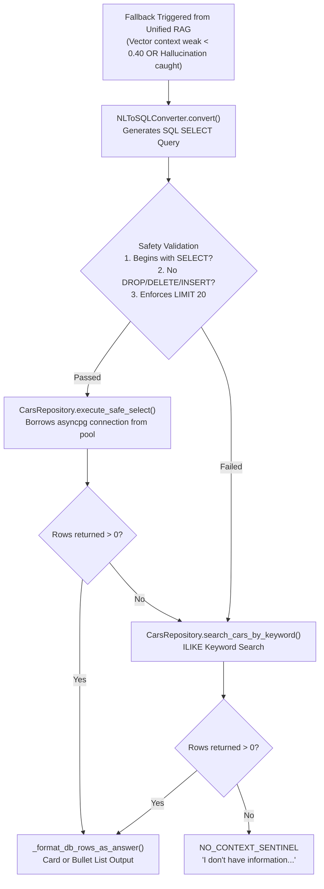
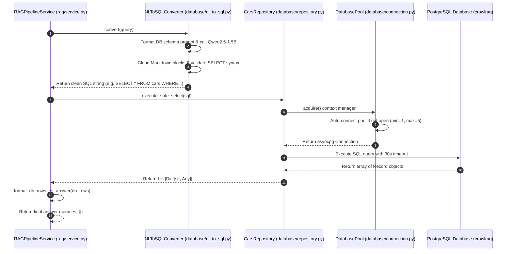

# 🐘 PostgreSQL Database Fallback Module — Deep-Dive Technical Guide

The **PostgreSQL Database Fallback Module** provides a structured relational data fallback layer for CrawlRAG. When unstructured web vector search fails, has weak context coverage, or generates ungrounded hallucinations, this module converts the user's natural language question into a safe SQL query and retrieves structured records directly from PostgreSQL.

---

## 📌 1. High-Level Purpose — Why PostgreSQL Fallback?

Unstructured vector search is great for articles and unstructured paragraphs, but terrible for **structured inventory queries** (e.g. `"Which Porsche models cost more than 300,000 USD?"` or `"Show me available BMW cars under 200,000 USD"`).

By linking a structured PostgreSQL database with an automated Natural Language to SQL (NL-to-SQL) engine, CrawlRAG can seamlessly answer structured data queries with 100% precision.



---

## 🔄 2. Step-by-Step Fallback Execution Flow



---

## 🔌 3. Component Deep Dive & Code Implementation

### A. High-Performance Async Pool (`DatabasePool`)
- **File Path**: [`app/modules/database/connection.py`](file:///d:/data-scraping-rag/data-scraping/backend/app/modules/database/connection.py#L30-L125)
- **Library**: `asyncpg` (Fastest PostgreSQL driver for Python asyncio).
- **Settings**:
  - `POSTGRES_POOL_MIN_SIZE`: `1`
  - `POSTGRES_POOL_MAX_SIZE`: `5`
  - `POSTGRES_COMMAND_TIMEOUT`: `30.0` seconds
- **Auto-Connect Feature**: `DatabasePool.acquire()` automatically detects if the connection pool is uninitialized and invokes `await self.connect()`, preventing connection errors in test environments or CLI scripts.

### B. Natural Language to SQL Converter (`NLToSQLConverter`)
- **File Path**: [`app/modules/database/nl_to_sql.py`](file:///d:/data-scraping-rag/data-scraping/backend/app/modules/database/nl_to_sql.py#L30-L140)
- **Method**: `NLToSQLConverter.convert(question: str) -> Optional[str]`
- **Prompt Architecture**: Feeds table DDL schema to `Qwen2.5-1.5B-Instruct`:
  ```text
  Schema:
  CREATE TABLE cars (
      brand VARCHAR(100), model VARCHAR(200), year INTEGER,
      country_of_origin VARCHAR(100), mileage_km INTEGER,
      price_usd NUMERIC(12, 2), status VARCHAR(50), category VARCHAR(100)
  );
  Question: {question}
  Output ONLY valid SQL SELECT statement. No explanation.
  ```

### 🛡️ SQL Safety Enforcement Rules:
1. **SELECT-Only Filter**: Rejects any generated string that does not start with `SELECT`.
2. **Forbidden Keywords Rejection**: Instantly blocks destructive statements containing `DROP`, `DELETE`, `INSERT`, `UPDATE`, `ALTER`, `TRUNCATE`, `GRANT`, `EXEC`.
3. **Hard `LIMIT` Injection**: If the LLM omits a `LIMIT` clause, `_enforce_limit()` automatically appends `LIMIT 20` to protect server memory.

### C. Cars Repository & Table Schema (`CarsRepository`)
- **File Path**: [`app/modules/database/repository.py`](file:///d:/data-scraping-rag/data-scraping/backend/app/modules/database/repository.py#L30-L270)
- **DDL Schema**:
  ```sql
  CREATE TABLE IF NOT EXISTS cars (
      id                SERIAL          PRIMARY KEY,
      brand             VARCHAR(100)    NOT NULL,
      model             VARCHAR(200)    NOT NULL,
      year              INTEGER,
      country_of_origin VARCHAR(100),
      mileage_km        INTEGER,
      price_usd         NUMERIC(12, 2),
      status            VARCHAR(50),
      category          VARCHAR(100),
      description       TEXT,
      created_at        TIMESTAMPTZ     DEFAULT NOW(),
      UNIQUE (brand, model, year)
  );
  ```

### Keyword Fallback (`search_cars_by_keyword`):
If NL-to-SQL fails or returns zero rows, the repository executes a safe parameterised keyword query:
```sql
SELECT * FROM cars
WHERE brand ILIKE $1 OR model ILIKE $1 OR category ILIKE $1
ORDER BY price_usd DESC LIMIT 10;
```

---

## 🎨 4. Data Formatting Example

### Raw PostgreSQL Result Rows:
```json
[
  {
    "brand": "Porsche",
    "model": "911 Carrera RS 2.7",
    "year": 1973,
    "status": "Reserved",
    "price_usd": 950000.0
  },
  {
    "brand": "Porsche",
    "model": "356 Speedster",
    "year": 1958,
    "status": "Available",
    "price_usd": 310000.0
  }
]
```

### Formatted Output Answer (`_format_db_rows_as_answer`):
```text
Found 2 matching car(s):
  • Porsche 911 Carrera RS 2.7 (1973) — Reserved — USD 950,000
  • Porsche 356 Speedster (1958) — Available — USD 310,000
```

---

## 💡 Code Symbol Map

- `DatabasePool.acquire()`: Async context manager borrowing database connections.
- `NLToSQLConverter.convert()`: Natural language to safe SQL query converter.
- `CarsRepository.execute_safe_select()`: Executes sanitized SELECT query.
- `CarsRepository.search_cars_by_keyword()`: Fallback ILIKE search.
- `_format_db_rows_as_answer()`: Converts DB row dictionaries to clean human-readable text.
